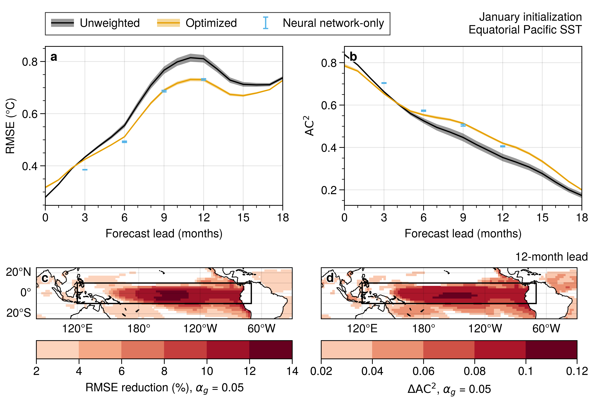
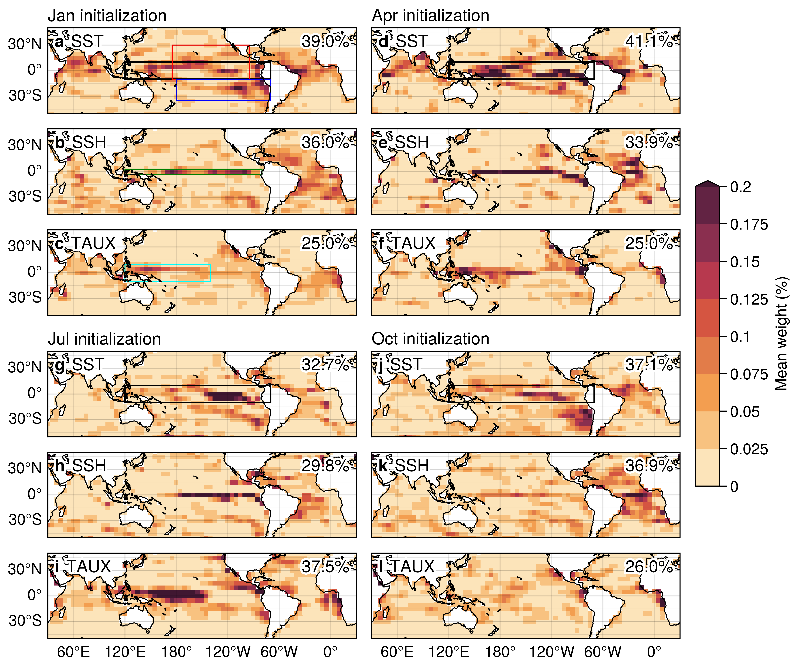

# Deep Learning Model-Analog (DLMA)

A skillful and interpretable seasonal forecasting approach by combining deep learning and model-analog forecasting. 
This technique, called **optimized model-analog**, leverages U-Net to identify important areas for selecting analog members.

This repository contains the code for the paper titled "Using Deep Learning to Identify Initial Error Sensitivity for Interpretable ENSO Forecasts" by Toride et al. A preprint is available at https://arxiv.org/abs/2404.15419.

## Concept
The figure below illustrates the concept of this approach. 
Subpanel (a) shows a sample condition we aim to forecast. 
In subpanel (b), without the use of machine learning, some analogs may evolve into the opposite phase of ENSO. 
Subpanel (c) demonstrates that with this approach, the ensemble forecasts of the El Niño event are significantly improved.


## Architecture
The U-Net predicts weights for the corresponding input variables. These weights highlight sensitive (important) regions for target growth. 
The predicted weights determine the weighted initial distances for every sample within the library. 
The top 2% of samples (dark blue circles) are then used to calculate the loss function. 
This loss function updates the U-Net parameters so that samples with smaller forecast errors 
have smaller weighted initial distances (indicated by dark blue arrows in the scatter plot).


## Installation
To set up the environment, run the following command:  
```
conda env create -f condaenv.yml
```  

To use the plotting modules in `plot`, a seperate environment needs to be installed. This environment includes [proplot](https://proplot.readthedocs.io/en/stable/).
```
conda env create -f plotenv.yml
```  

## Data
Download the required data and place it in the `data` directory. The data can be found at https://doi.org/10.5281/zenodo.11048404.

The `data/cesm2` directory contains the Community Earth System Model Version 2 Large Ensemble ([CESM2-LE](https://doi.org/10.26024/kgmp-c556)), while the `data/real` directory contains the Ocean Reanalysis System 5 ([ORAS5](https://doi.org/10.24381/cds.67e8eeb7)) datasets. These datasets have been processed to provide detrended monthly anomalies and have been interpolated to two different resolutions: 2° × 2° and 5° × 5°. The 5°×5° files are used as input, while the 2°×2° files are used for analog forecasting.
```
├── cesm2
│   ├── sst_anomaly_5x5.nc
│   ├── ssh_anomaly_5x5.nc
│   ├── sst_anomaly_2x2.nc
│   ├── ssh_anomaly_2x2.nc
│   ...
│   
└── real
    ├── sst_anomaly_5x5.nc
    ...
```

## Usage
Navigate to the `DLMA` directory to find the `.ipynb` files for running the model. By default, the model runs from an initialization in January with a single ensemble.

0. Calculate all combinations of distances between samples over the target region and variable  
    - `0-1_target_distance.ipynb`: Calculate the distances
    - `0-2_target_distance_shadow.ipynb`: Calculate averaged target distances over mutiple lags
    - `0-3_target_distance_real.ipynb`: For a reanalysis dataset

1. Train
    - `1_train.ipynb`: Train the model

2. Test
    - `2-1_test.ipynb`: Generate model analog indices and weights 
    - `2-2_eval_stat.ipynb`: Evaluates forecast skill

3. Test using a reanalysis dataset
    - `3-1_test.ipynb`: Test the model using reanalysis dataset
    - `3-2_eval_stat.ipynb`: Evaluate forecast skill using reanalysis dataset

## Usage of MA and DL_only
For comparison, the traditional model-analog forecasting method is provided in the `MA` directory. In addition, an equivalent deep learning only approach is provided in the `DL_only` directory.

Navigate to the `MA` directory for the traditional model-analog forecasting.

1. `1_MA.ipynb`: Find model-analog indices
2. `2_MA_stats.ipynb`: Evaluates forecast skill
3. `3_MA_real.ipynb`: Find model-analog indices using reanalysis dataset
4. `4_MA_real_stats.ipynb`: Evaluate forecast skill using reanalysis dataset

Navigate to the `DL_only` directory for the deep learning only approach.

1. `1_train.ipynb`: Train the ML only model
2.  `2_test.ipynb`: Test the ML only model

## Plot
Navigate to the `plot` directory and use the plotting environment.

`skill.ipynb`: Plot skill.  
`weight`: Plot weights estimated by DLMA. These weights show important regions for selecting analogs.

## Results

### Forecast skill comparison


### Improvements in extreme events


### Interpretable weights

